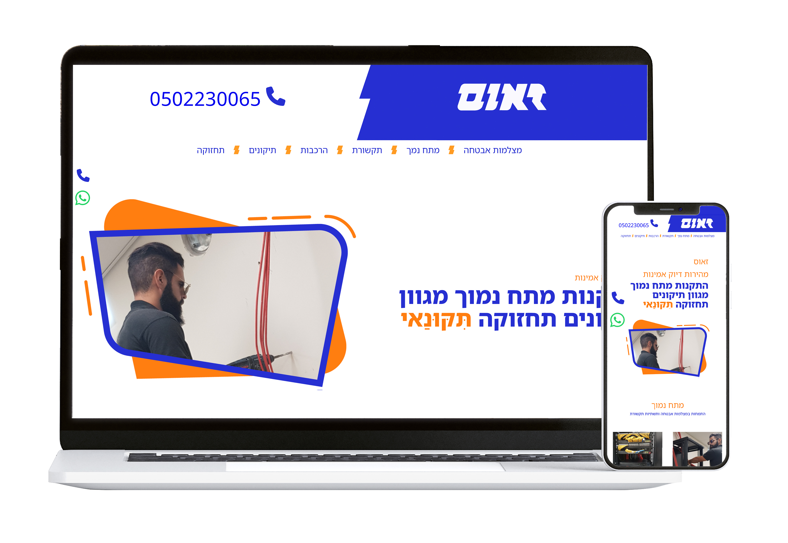

# Zeus Fix – Technician Landing Page & Brand Identity



**Live site**: [https://zeusfix.me](https://zeusfix.me)

A responsive one-page website built for an independent low-voltage technician, specializing in electrical systems such as camera installation and maintenance.  
The site functions as a digital business card, providing clients with a clear overview of services and direct contact options.

In addition to development, I also designed the **brand identity** — including the logo, color scheme, visual assets, and print materials.

---
---

## 🛠️ Website Features

- **Fully responsive** – mobile-first layout, also optimized for desktop
- **Single-page layout** – fast loading, no navigation overhead
- **Direct contact links** – phone, WhatsApp, and social media
- **Simple HTML/CSS** – lightweight and framework-free
- **Live and maintained** – used in production by the business owner

---

## 🎨 Branding & Design

Although this is a small-scale local business, I treated the branding with full professional care:

- **Logo design** – clean, technical, and minimal
- **Visual language** – fonts, colors, icon style
- **Business cards** – matching print design for in-person interactions
- **Installation stickers** – small branded labels placed next to installed cameras, according to technical standards
- **Website UI** – responsive, accessible, and brand-consistent

All design and development were done by me.


---

## 📁 Project structure

```bash
.
├── index.html         # Main HTML file
├── style.css          # Main stylesheet
├── assets/            # Images, icons, and mockup (zeus.jpg)
